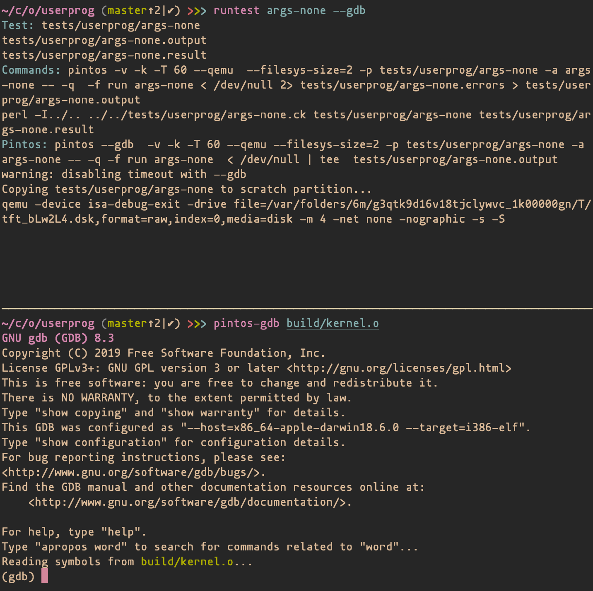
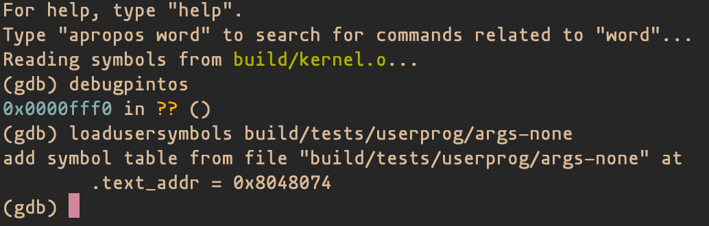
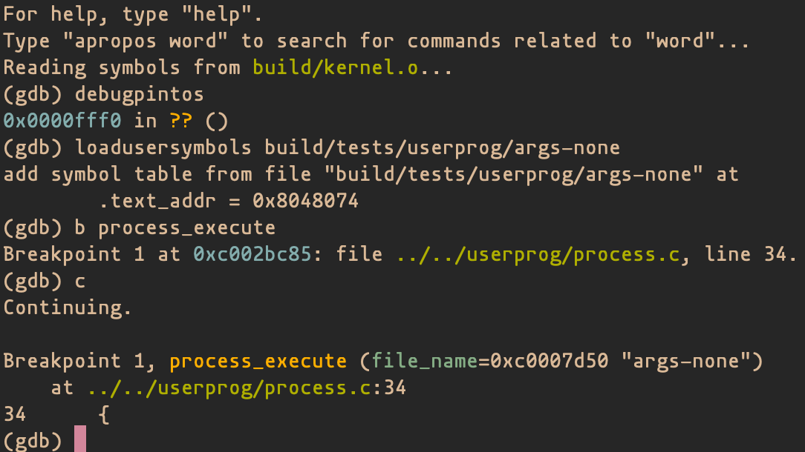

Pintos
======

Pintos labs for EE 382V at UT Austin.


Installation
------------

### Dependencies
Pintos relies on some core utilities, a gcc that can compile for i386, the corresponding binary utilities, gdb, and qemu. To get these on Debian-derived Linux distributions, run the following commands:

```bash
$ sudo apt update
$ sudo apt install build-essential coreutils binutils gcc qemu-system-x86
```

On macOS using [Homebrew](https://brew.sh):

```bash
$ brew install i386-elf-gcc i386-elf-binutils i386-elf-gdb qemu
```

### Install
Run the installation script, which will also check that you have the required programs available. Then, check that the installation went okay.

```bash
$ ./install.sh  # Follow the instructions it prints
$ echo $PINTOS  # Should point to your pintos directory
$ echo $PATH    # Should contain the `utils` directory
$ cd $PINTOS/userprog
$ make check    # You should fail all of the test cases
```

### Troubleshooting
 - Run the install script again
 - Make sure your bashrc is setting the `$PINTOS` and `$PATH` variables correctly
 - Re-source your bashrc


Running Tests
-------------

All of these commands assume you are inside a project directory, such as `userprog` or `vm`.

### All tests
```bash
$ make check
```

### Individual tests
```bash
# Get into the proper project directory
$ cd $PINTOS/userprog
$ make
# View the possible tests (the executables)
$ ls build/tests/{userprog,filesys/base}
# Run whatever tests you want
$ runtest args-none syn-read
```

### Previewing your grade
```bash
$ make grade
# Or, if the file is up-to-date:
$ cat build/grade
```

Note: This script output will *not* necessarily match your grade on the lab. Some synchronization bugs may appear to be fine on your machine, but then fail when we grade the lab.

Debugging
---------

Using [GDB](https://www.gnu.org/software/gdb/documentation/), or a GDB frontend, is mandatory. The Stanford documentation has an entire [chapter on debugging tools](https://web.stanford.edu/class/cs140/projects/pintos/pintos_10.html#SEC145), including a [section on GDB](https://web.stanford.edu/class/cs140/projects/pintos/pintos_10.html#SEC15). The techniques that these describe will be very useful for debugging your operating system, so please read through them!

### Running tests
To start debugging, use the `runtest` script as described above, adding the `--gdb` flag. For example:

```bash
$ runtest args-none --gdb
```

You'll notice that the output is paused. This is because the Pintos process you just ran is waiting for you to attach your GDB debugger. Open up a new terminal tab, window, or pane. Consider learning a tool like [tmux](https://github.com/tmux/tmux/) or [GNU Screen](https://www.gnu.org/software/screen/). Then, use `pintos-gdb` to attach your GDB debugger to the running Pintos process.

```bash
# Assumes you are in the project directory.
$ pintos-gdb build/kernel.o  # optionally add the `--tui` flag
```

At this point, you should see something like this:



Next, you will have to attach GDB to the Pintos process. You can do this using the `debugpintos` macro. You may also want to load symbols from the user program (test case) to allow you to step through inside the test case. Type `debugpintos` at the prompt, followed by `loadusersymbols build/tests/userprog/args-none`. You may omit the `loadusersymbols` command if you only want to debug the kernel itself, but you **must** include `debugpintos`.



Now, GDB is ready to debug. If the Pintos process ever hangs and you are unable to kill it with control-C, try `pkill pintos`.



Project Submission
------------------

Submit your code as a single file named  project.tgz on Canvas. Do not forget to complete the design document.